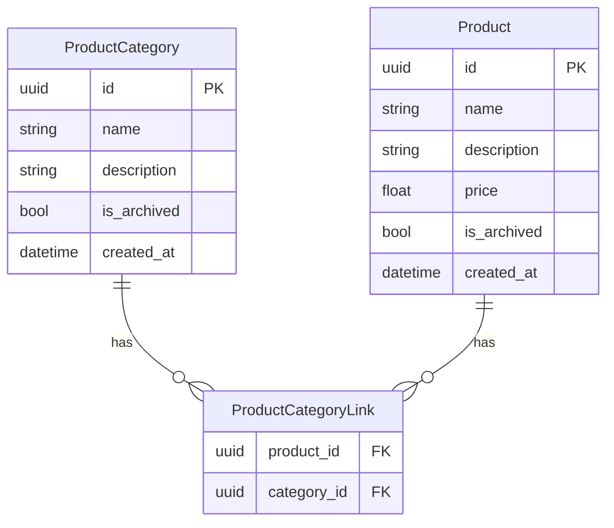

# Tạo Module Product Category & Product (Many-to-Many)

## Bối cảnh

Tạo 2 module: **ProductCategory** và **Product** với quan hệ **Many-to-Many** (N-N).
Ví dụ: "Matcha Cà Phê" vừa thuộc category "Matcha" vừa thuộc category "Cà Phê".

Quan hệ N-N cần **junction table** (`product_category_link`) để nối 2 bảng.



## User Review Required

> [!IMPORTANT]
> **Không có `owner_id`**: Cả 2 module đều là dữ liệu quản lý chung (ERP), không gắn user cá nhân. Mọi user đã đăng nhập đều xem/sửa được. Bạn đồng ý không?

> [!IMPORTANT]
> **Soft delete bằng `is_archived`**: Thay vì xoá cứng, dùng field `is_archived` giống UOM. Delete endpoint sẽ set `is_archived = True` thay vì xoá bản ghi. Bạn đồng ý không?

> [!IMPORTANT]
> **Khi tạo Product**, API sẽ nhận danh sách `category_ids: list[uuid]` để gắn categories ngay lúc tạo. Tương tự khi update. Bạn muốn vậy không?

---

## Proposed Changes

### Module product_category

#### [NEW] [models.py](file:///Users/tuan/coffeetree-erp/backend/app/modules/product_category/models.py)

- `ProductCategoryBase` — name, description, is_archived
- `ProductCategoryCreate` — kế thừa Base
- `ProductCategoryUpdate` — tất cả optional
- `ProductCategory` (table) — id, created_at
- `ProductCategoryPublic` — trả qua API
- `ProductCategoriesPublic` — list + count

#### [NEW] [crud.py](file:///Users/tuan/coffeetree-erp/backend/app/modules/product_category/crud.py)

- `get_category`, `get_category_by_name`, `get_categories`, `create_category`, `update_category`, `delete_category` (soft delete → `is_archived = True`)

#### [NEW] [routes.py](file:///Users/tuan/coffeetree-erp/backend/app/modules/product_category/routes.py)

- 5 endpoints: `GET /`, `GET /{id}`, `POST /`, `PUT /{id}`, `DELETE /{id}`
- Prefix: `/product-categories`

---

### Module product

#### [NEW] [models.py](file:///Users/tuan/coffeetree-erp/backend/app/modules/product/models.py)

- `ProductCategoryLink` (junction table) — `product_id` FK, `category_id` FK
- `ProductBase` — name, description, price, is_archived
- `ProductCreate` — kế thừa Base + `category_ids: list[uuid]` (optional)
- `ProductUpdate` — tất cả optional + `category_ids: list[uuid] | None`
- `Product` (table) — id, created_at, Relationship → categories qua link table
- `ProductPublic` — trả qua API, kèm `categories: list[ProductCategoryBase]`
- `ProductsPublic` — list + count

#### [NEW] [crud.py](file:///Users/tuan/coffeetree-erp/backend/app/modules/product/crud.py)

- `get_product` (eager-load categories), `get_products`, `create_product` (tạo + sync link table), `update_product` (update + sync link table), `delete_product` (soft delete)

#### [NEW] [routes.py](file:///Users/tuan/coffeetree-erp/backend/app/modules/product/routes.py)

- 5 endpoints: `GET /`, `GET /{id}`, `POST /`, `PUT /{id}`, `DELETE /{id}`
- Prefix: `/products`
- Validate `category_ids` khi create/update (kiểm tra FK tồn tại)

---

### Đăng ký modules

#### [MODIFY] [main.py](file:///Users/tuan/coffeetree-erp/backend/app/api/main.py)

Thêm 2 import + 2 include_router cho product_category và product.

#### [MODIFY] [env.py](file:///Users/tuan/coffeetree-erp/backend/app/alembic/env.py)

Thêm 2 dòng import model cho Alembic autogenerate.

---

## Thứ tự tạo file

1. `product_category/models.py` ← tạo trước vì Product phụ thuộc
2. `product/models.py` ← chứa cả junction table `ProductCategoryLink`
3. `product_category/crud.py`
4. `product_category/routes.py`
5. `product/crud.py`
6. `product/routes.py`
7. Đăng ký `api/main.py` + `alembic/env.py`
8. Chạy migration

## Verification Plan

### Automated Tests
```bash
docker compose exec backend alembic revision --autogenerate -m "add product_category product tables"
docker compose exec backend alembic upgrade head
```
- Kiểm tra Swagger UI tại `http://localhost:8000/docs`
- Test tạo Category → tạo Product với `category_ids` → verify Product trả về kèm categories

### Manual Verification
- Tạo 2 categories: "Matcha", "Cà Phê"
- Tạo product "Matcha Cà Phê" với `category_ids` = [id_matcha, id_cafe]
- GET product → verify trả về cả 2 categories
